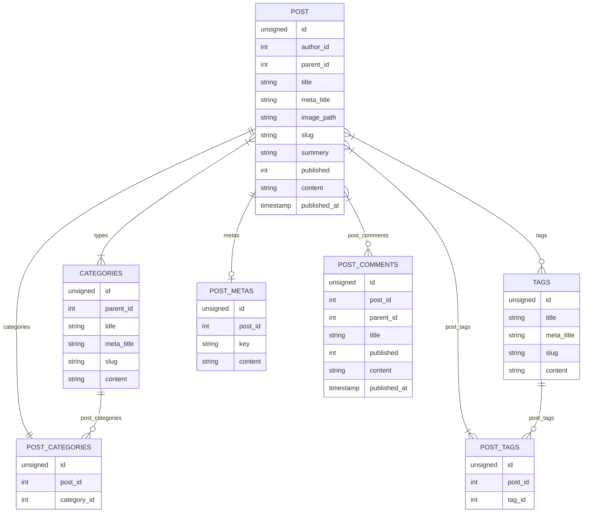

```mermaid
erDiagram
    
    
    POST {
        unsigned  id
        int  author_id
        int  parent_id
        string title 
        string meta_title
		string image_path
        string slug
        string summery
        int  published
        string content
		timestamp published_at
    }
	
	CATEGORIES {
        unsigned  id
        int  parent_id
        string title 
        string meta_title
        string slug
        string content
     
    }
     
    TAGS {
        unsigned  id
        string title 
        string meta_title
        string slug
        string content
    }
   
	

    POST_TAGS{
        unsigned  id
        int  post_id
        int  tag_id
        
     
    }
	
	POST_CATEGORIES{
        unsigned  id
        int  post_id
        int  category_id
        
     
    }

    POST_METAS{

        unsigned  id
        int  post_id
		string  key
        string  content
        
    }


    POST_COMMENTS{

        unsigned  id
        int  post_id
        int  parent_id
        string title 
        int  published
        string content
		timestamp published_at
        
    }


	POST }|--|{ CATEGORIES : types
    POST ||--|| POST_CATEGORIES : categories
    CATEGORIES ||--o{  POST_CATEGORIES : post_categories
    
    POST }|--o{ TAGS : tags
    POST }|--|{ POST_TAGS : post_tags
    TAGS ||--o{ POST_TAGS : post_tags
    
    
    POST ||--o| POST_METAS : metas
    POST }|--o{ POST_COMMENTS : post_comments
	
```

